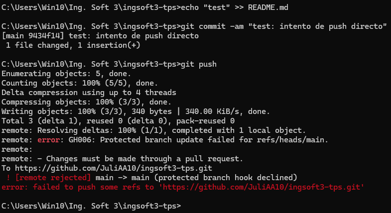
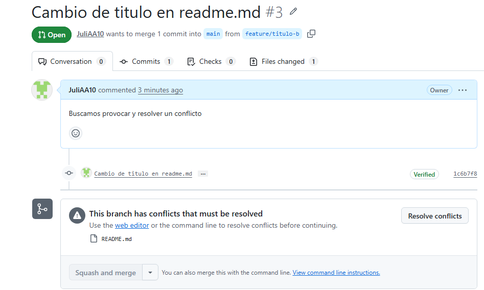
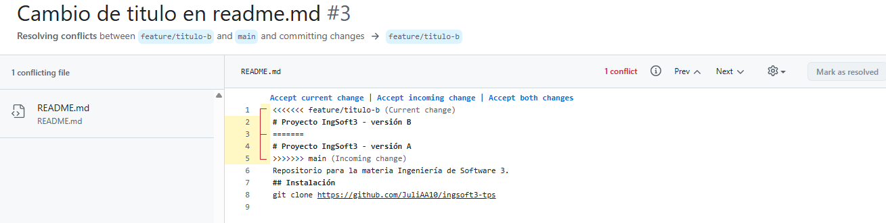
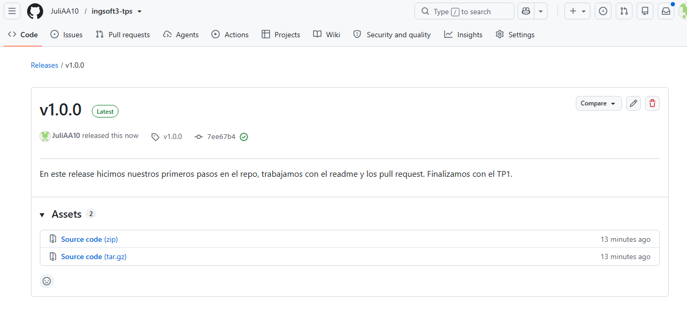
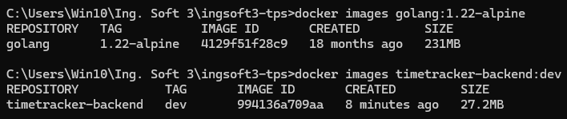
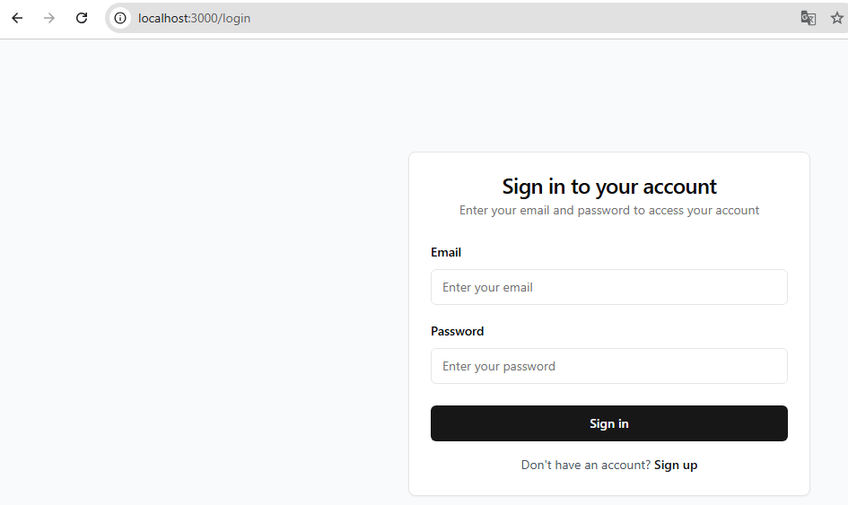
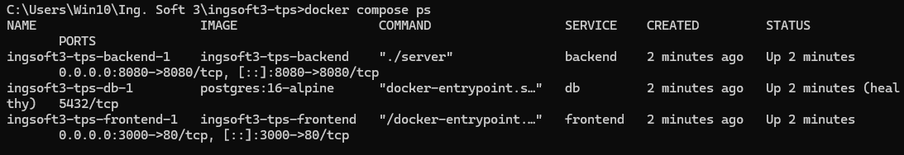
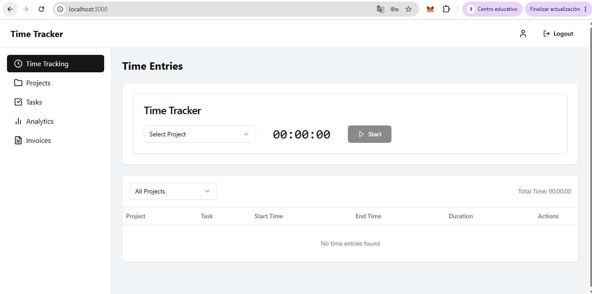

# Evidencias — TP1

## 1. Push directo a main rechazado

GitHub rechaza el push directo porque la rama `main` está protegida y la protección también se aplica al administrador del repositorio.

## 2. Conflicto en el Pull Request

GitHub detecta que la rama `feature/titulo-b` no puede integrarse automáticamente con `main` porque ambas modificaron la misma línea del archivo `README.md`.

## 3. Marcadores del conflicto

Se observan los marcadores `<<<<<<<`, `=======` y `>>>>>>>` que Git utiliza para indicar las dos versiones que están en conflicto.

## 4. Release v1.0.0 publicada

Se observa la release `v1.0.0` publicada a partir del tag correspondiente.

# Evidencias — TP2

## 1. Comparación de Imagen contra SDK

La imagen golang:1.22-alpine contiene el SDK y compilador de Go necesarios durante el build. Gracias al multi-stage build, la imagen final no incluye esas herramientas, sino únicamente el binario compilado y un runtime Alpine mínimo. Por eso la imagen final es considerablemente más pequeña.

## 2. Verificación frontend aislado

El frontend levantado por su lado nos anda correctamente, claro que, al no estar levantado en conjunto con el backend, tiene problemas a la hora de loguearse/registrarse.

## 3. Docker Compose hecho correctamente

Podemos verificar que el docker compose ps nos muestra las 3 imagenes levantadas corriendo en su determinado puerto y haciendo que la aplicación generada funcione de correcta manera, todo esto levantandolo de un solo docker compose up -d --build.

## 4. Probamos aplicación

![Persistencia] (img/prueba-persistencia.png)
Verificamos que cambios realizados en la aplicación, sean persistentes y se mantengan a pesar de realizar pruebas de docker compose down + up. Manteniendo los datos y validando que siguen existiendo.
Además, verificamos que con el docker compose down -v, ahí si se pierden los datos de la base de datos, es decir, no solo se apaga sino que el motor se "olvida".

## 5. Imagenes publicadas en el Registry

![Imagenes públicas] (img/img-publicadas.png)
Ya tenemos nuestras imágenes públicas publicadas en el registry y las podemos ver en Packages en nuestro perfil de Github.
